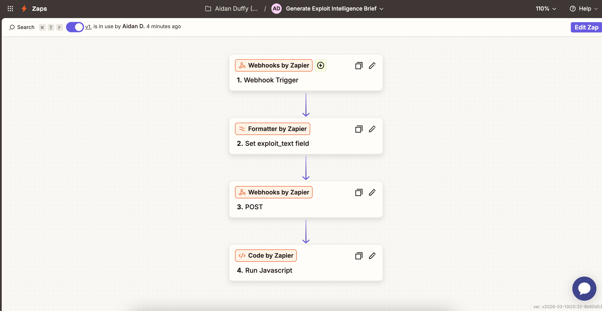

# Crypto Exploit Intelligence API

A FastAPI-based service for analyzing crypto exploits and generating structured security intelligence briefs using AI-powered analysis.

## 🚀 Live API

**Production URL**: `https://cantina-intel-production.up.railway.app`

**API Documentation**: https://cantina-intel-production.up.railway.app/docs

## Architecture

### System Overview

```
┌─────────────────┐
│  Webhook/Zapier │ → Triggers workflow
└────────┬────────┘
         │
         ▼
┌─────────────────┐
│   FastAPI API   │ → Receives exploit text
│  (Railway Host) │
└────────┬────────┘
         │
         ▼
┌─────────────────┐
│  OpenAI GPT-4o  │ → Analyzes exploit
│   (Analysis)    │
└────────┬────────┘
         │
         ▼
┌─────────────────┐
│  OpenAI GPT-4o  │ → Generates brief
│  (Brief Gen)    │
└────────┬────────┘
         │
         ▼
┌─────────────────┐
│  JSON Response  │ → Returns structured brief
└─────────────────┘
```

### Components

- **FastAPI Backend**: Python-based REST API
- **OpenAI Integration**: GPT-4o for exploit analysis and brief generation
- **Railway Deployment**: Cloud-hosted with automatic CI/CD
- **Zapier Automation**: Webhook-based workflow automation

### Technology Stack

- **Backend**: FastAPI (Python 3.11)
- **AI**: OpenAI GPT-4o
- **Deployment**: Railway
- **Automation**: Zapier
- **Dependencies**: See `requirements.txt`

## Setup

1. Install dependencies:
```bash
pip install -r requirements.txt
```

2. Configure environment variables:
   - Create `.env` file
   - Add: `OPENAI_API_KEY=your_api_key_here`

3. Run the application:
```bash
uvicorn app.main:app --reload
```

The API will be available at `http://localhost:8000`

## API Endpoints

### POST /generate-brief

Generates a Security Intelligence Brief from exploit text. Automatically performs analysis first, then generates the brief.

**Example Request:**
```bash
curl -X POST https://cantina-intel-production.up.railway.app/generate-brief \
  -H "Content-Type: application/json" \
  -d '{
    "text": "Euler Finance exploit involving flash loans and a donation attack that manipulated collateral accounting."
  }'
```

**Example Response:**
```json
{
  "title": "Critical Flash Loan Vulnerability in Euler Finance's Collateral Management Module",
  "executive_summary": "A critical vulnerability in Euler Finance's collateral management module has been exploited through a flash loan attack. The flaw in the business logic allows attackers to manipulate collateral accounting, posing a severe risk to the protocol's integrity and user funds.",
  "threat_level": "Critical",
  "recommendations": [
    "Conduct a comprehensive audit of the collateral management module",
    "Implement stricter validation checks and state consistency mechanisms",
    "Deploy real-time monitoring and anomaly detection systems",
    "Enhance the security of the flash loan mechanism",
    "Educate developers on secure coding practices"
  ],
  "brief": "Euler Finance, a decentralized finance protocol, has been compromised through a critical flash loan attack targeting its collateral management module. The exploit leverages incorrect state updates within the module, allowing attackers to manipulate the protocol's collateral accounting processes..."
}
```

### POST /analyze-exploit

Analyzes exploit report text and extracts structured intelligence.

**Example Request:**
```bash
curl -X POST https://cantina-intel-production.up.railway.app/analyze-exploit \
  -H "Content-Type: application/json" \
  -d '{
    "exploit_text": "Euler Finance exploit involving flash loans and a donation attack..."
  }'
```

**Example Response:**
```json
{
  "protocol_name": "Euler Finance",
  "exploit_type": "Flash loan attack",
  "vulnerability_pattern": "State inconsistency in collateral accounting",
  "root_cause": "Missing validation checks in donation mechanism",
  "affected_smart_contract_component": "donateToReserves function",
  "risk_category": "Critical"
}
```

## Automation Workflow

The system is integrated with Zapier for automated exploit analysis:



**Workflow Steps:**
1. **Webhook Trigger** - Receives exploit text
2. **Formatter** - Sets exploit_text field
3. **HTTP Request** - POSTs to `/generate-brief` endpoint
4. **Code** - Extracts and formats the brief field

See `ZAPIER_WORKFLOW_FINAL.json` for complete workflow configuration.

## Testing

### Quick Test

1. Open https://cantina-intel-production.up.railway.app/docs in your browser
2. Navigate to `POST /generate-brief`
3. Click "Try it out"
4. Use the example payload:
   ```json
   {
     "text": "Euler Finance exploit involving flash loans and a donation attack that manipulated collateral accounting."
   }
   ```
5. Click "Execute"

The API will return a structured security intelligence brief with analysis and recommendations.

## Deployment

Deploy to Railway:
1. Push to GitHub
2. Connect Railway to your GitHub repo
3. Add `OPENAI_API_KEY` environment variable
4. Railway auto-detects FastAPI and deploys

## Documentation

Interactive API documentation:
- **Swagger UI**: https://cantina-intel-production.up.railway.app/docs
- **ReDoc**: https://cantina-intel-production.up.railway.app/redoc

## License

MIT License
